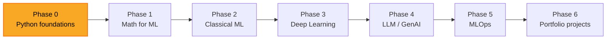

### Hi, I'm Martyn 👋

Software developer, 9 years in. Learning in public — building an ML engineering path openly on GitHub. Based in Ukraine.

---

### 🎯 What I'm working on

<p>
  <a href="https://github.com/peacepeacecreation/MLLearning">
    
  </a>
  <a href="https://github.com/peacepeacecreation/roy">
    
  </a>
</p>

- **AI-augmented dev workflow** — custom Claude Code agents, hooks, and voice tooling built into my daily loop.

---

### 🎙️ Voice AI & realtime telephony — main area of expertise

Years of production experience across multiple voice AI platforms — multi-provider, multi-tenant, browser-to-phone. Own self-hosted stack for offline / private inference.

**Voice frameworks:**
[](https://pipecat.ai)
[](https://livekit.io)
[](https://daily.co)

**Telephony:**
[](https://twilio.com)
[](https://telnyx.com)
[](https://developer.vonage.com)
[](https://retellai.com)


**STT (speech-to-text):**
[](https://deepgram.com)
[-4CAF50?logo=openai&logoColor=white)](https://github.com/openai/whisper)

**TTS (text-to-speech):**
[](https://cartesia.ai)
[](https://elevenlabs.io)
[-4CAF50?style=flat)](https://github.com/rhasspy/piper)

**Realtime transport:** WebRTC · WebSocket · SIP

---

### 📊 Experience depth at a glance

```
Voice AI + realtime + telephony  ██████████████████████  Deep · years in production, multi-provider
Frontend (Vue / React / Next.js) ████████████████████    Deep · 5y Vue in insurance, SaaS platforms
Backends (Node.js + Python)      ████████████████████    Deep · Fastify, FastAPI, Express, Django
AI / LLM integration             ██████████████████      Solid · Claude, OpenAI, Gemini, OpenRouter
Databases                        ██████████████████      Solid · PostgreSQL, Prisma, Redis, Supabase
ML fundamentals                  ██████                  Learning · Phase 0 of a dedicated ML path
```

---

### 🛠️ Tech I work with

**Languages:**   

**Backend & realtime:**      

**Frontend:**    

**AI / LLM:**    

**Databases & infra:**      

**Currently learning:**   

---

### 🗺️ Learning roadmap



Currently at **Phase 0** — Python foundations. Full plan and progress tracker: [ROADMAP.md](https://github.com/peacepeacecreation/MLLearning/blob/main/ROADMAP.md) · [PROGRESS.md](https://github.com/peacepeacecreation/MLLearning/blob/main/PROGRESS.md).

---

### 📊 Stats

<p>
  
</p>

### 📈 Code breakdown by language

<p align="center">
  
</p>

*Public repos on `peacepeacecreation` only. Private projects and code on other accounts not counted.*

---

### 📬 Get in touch

- 📧 **peacepeacecreation@gmail.com**
- 💬 **Telegram:** [@ukrainianmartyn](https://t.me/ukrainianmartyn)
