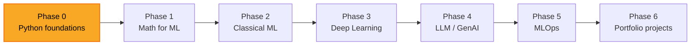

### Hi, I'm Martyn 👋

Software developer, 9 years in. Learning in public — building an ML engineering path openly on GitHub. Based in Ukraine.

**Solid ground:** realtime backends · WebRTC & voice pipelines · TypeScript/React · AI-tool integration (Claude Code, Anthropic SDK)
**Growing into:** ML fundamentals · model training · self-hosted inference at production scale

---

### 🎯 What I'm working on

  
  

- **AI-augmented dev workflow** — custom Claude Code agents, hooks, and voice tooling built into my daily loop.

---

### 🛠️ Tech I work with

**Languages:**   

**Backend & realtime:**    

**Frontend:**   

**AI / LLM:**   

**Currently learning:**   

---

### 🗺️ Learning roadmap

Currently at **Phase 0** — Python foundations. Full plan and progress tracker: [ROADMAP.md](https://github.com/peacepeacecreation/MLLearning/blob/main/ROADMAP.md) · [PROGRESS.md](https://github.com/peacepeacecreation/MLLearning/blob/main/PROGRESS.md).

---

### 📊 Stats

  

### 📈 Code breakdown by language

  

*Public repos on `peacepeacecreation` only. Private projects and code on other accounts not counted.*

---

### 📬 Get in touch

- 📧 **peacepeacecreation@gmail.com**
- 💬 **Telegram:** [@ukrainianmartyn](https://t.me/ukrainianmartyn)
